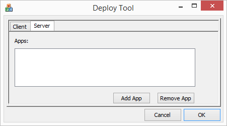
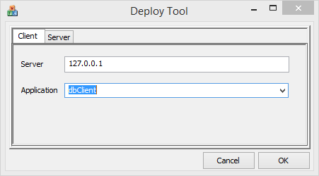

DeployTool
===
The DeployTool is designed to allow an executable to be pushed easily from one computer to each of the computers displaying content for the sides of the cube.  It is originally run on the source computer with the application (or in our parlance "Server") and is pointed at an executable somewhere on the Server's drive.  Whenever a Client connects or a file is changed in this directory a new build is copied down to all the Clients watching this Server and the application is restarted on each of the Clients.

## Setting up Server

 1. Copy DeployTool.exe to the Server machine and start it.
 2. Click on the Server tab to switch over to server mode.
 3. Press the "Add App" button to select an application executable on your machine.
 4. Press ok.
 
## Setting up Clients

 1. Copy DeployTool.exe to each of the Client machines where you want to distribute the build and start it.
 2. Click on the Client tab to switch over to client mode if you are not in that mode already.
 3. In the Server edit box enter the IP address of the Server.
 4. In the Application combo box select the application which you want to deploy on that machine.
 5. The build should start copying over and will start once all files are copied.  If the Server and Clients' DeployTool applications continue to run new revisions of the application will be copied over when files change on the server.