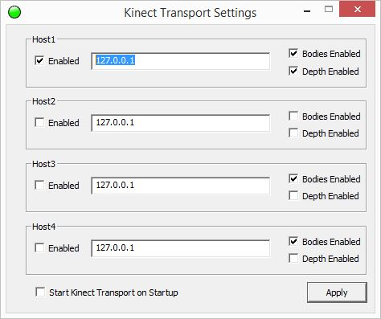

KinectTransport
===
KinectTransport is designed to push Kinect2 data from one machine to one or many other machines over a ethernet network.  This allows the creation of a variety of different configurations of Cube applications.  Data can be sent from individual Clients to a centralized Server to be processed or alternatively can be pushed to a variety of Client applications running on the Client machines themselves (including applications written in languages not natively supported by the Kinect2 SDK).  Currently KinectTransport supports sending Body (including Joint position, orientation and hand state) and Depth data to up to four machines.  Any of these can also be the local machine (by using the 127.0.0.1 loopback IP address).

## Running KinectTransport

 1. Copy KinectTransport.exe to a Client machine and start it.
 2. Enable one of the hosts and enter an IP address or domain name for it.
 3. Enable the data streams that are applicable.
 4. When a destination is connected and data is being received the system tray icon will turn from a red light to a green light.