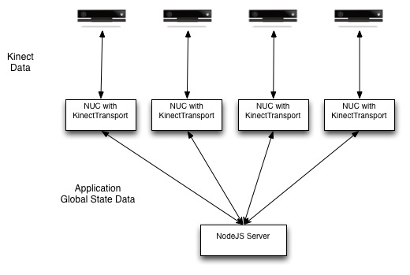

# Cube SDK Architecture

The purpose of the Cube SDK is to tie together multiple PCs and Kinects into a global interactive experience.  In order to do this, tools are provided to transport Kinect data and sample apps for creating an interactive experience on the client and a shared experience on the server are provided.

Since each Kinect needs to be connected to it's own machine the SDK provides the KinectTransport app for sending data to either a centralized server for further processing or directly to the machine connected to the Kinect for local processing.  In the cases where a shared experience is desired the data will be sent over UDP to a server that will then process the entire set of Kinect data and transmit just the applicaiton state back to the clients.  An alternative setup can also be created where the server is directly connected to the 5 projecters of the Cube and displays visuals for all sides on it's own.

